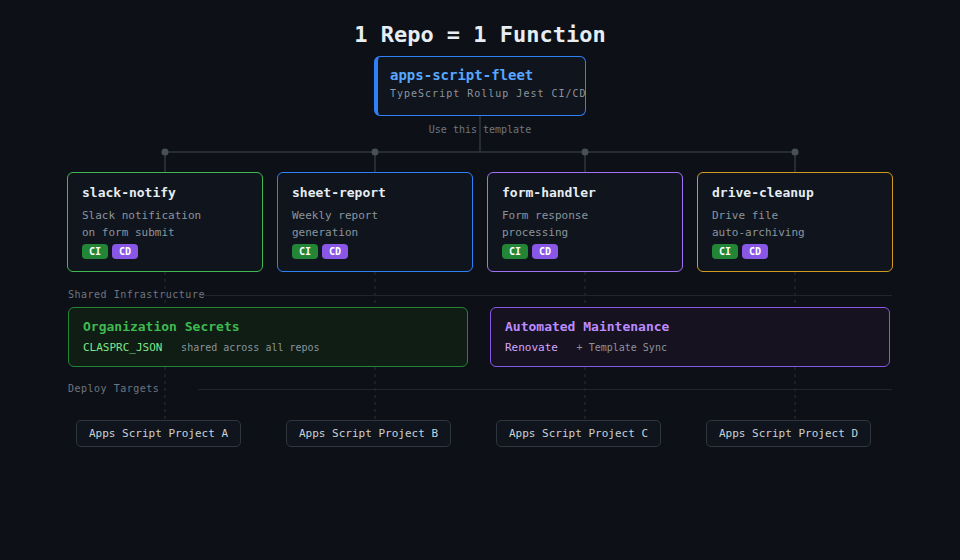
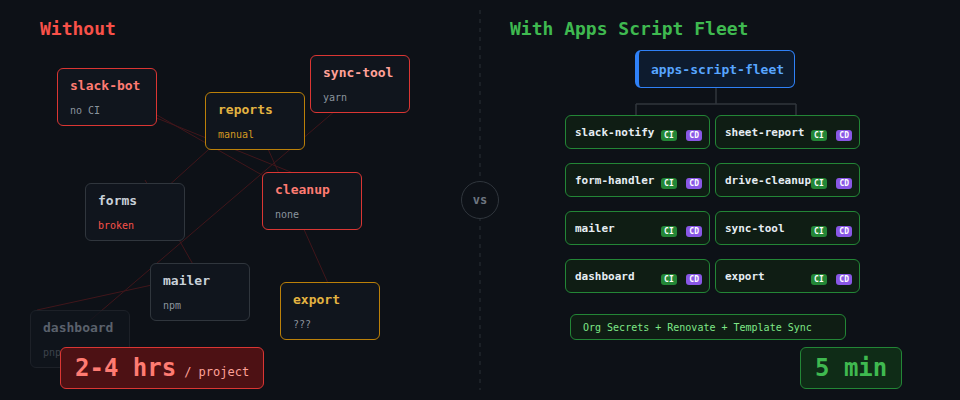
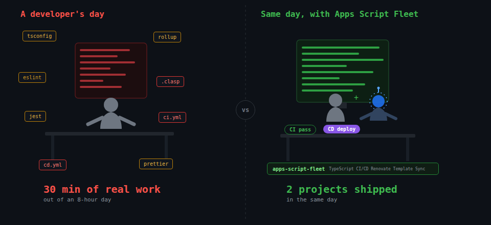

# Apps Script Fleet

[](https://github.com/h13/apps-script-fleet/actions/workflows/ci.yml)
[](https://github.com/h13/apps-script-fleet/blob/main/LICENSE)
[](https://nodejs.org/)
[](https://www.typescriptlang.org/)
[](https://developers.google.com/apps-script)

[日本語](README.ja.md)

**Infrastructure for scaling Google Apps Script across your organization.**

Most Apps Script templates help you set up _one_ project with modern tooling. This one is designed so you never have to set up tooling again — create a repo from this template, set a script ID, and your CI/CD pipeline is already running. Works with GitHub and GitLab — cloud and self-managed.

**[→ Quick Start](#quick-start)** · [What's Included](#whats-included) · [How This Differs](#how-this-differs) · [FAQ](#faq)

## The Problem

Apps Script projects start small, but they multiply. Slack notifications, report generation, form processing, Drive automation — before long, your organization has a dozen scripts. Each one needs:

- TypeScript configuration
- A bundler (Rollup, Webpack, Vite)
- Linting and formatting
- Test setup with coverage
- CI/CD workflows for dev and production
- clasp authentication management
- Ongoing dependency updates

Setting this up takes 2–4 hours per project. At 10 projects, that's a week of pure boilerplate — plus 10 different configurations to maintain going forward.

## The Solution: 1 Repo = 1 Function



Apps Script Fleet treats each function as an independent repository, backed by shared organizational infrastructure:

- **One-time setup**: Add `CLASPRC_JSON` to your org/group-level secrets ([GitHub](https://docs.github.com/en/actions/security-for-github-actions/security-guides/using-secrets-in-github-actions#creating-secrets-for-an-organization) or [GitLab](https://docs.gitlab.com/ci/variables/#for-a-group)). Every repo created from this template uses it automatically.
- **Per-project setup (~5 min)**: Create a repo from this template → set your script ID → done. CI runs on PRs/MRs, CD deploys on merge.
- **Fleet maintenance**: [Renovate](https://docs.renovatebot.com/) auto-updates dependencies across all repos. [Template sync](.github/workflows/sync-template.yml) propagates tooling improvements from the upstream template.

The difference at a glance:



## What's Included

| Category     | Tools                                                              |
| ------------ | ------------------------------------------------------------------ |
| Language     | TypeScript 7 (strict mode)                                         |
| Bundler      | Rollup (Apps Script–compatible output)                             |
| Deployment   | clasp (dev / prod environments)                                    |
| Testing      | Jest (80% coverage threshold)                                      |
| Linting      | Oxlint, Oxfmt, Stylelint, HTMLHint                                 |
| Git hooks    | husky + lint-staged                                                |
| CI/CD        | GitHub Actions + GitLab CI (CI on PR, CD on merge to `dev`/`main`) |
| Dependencies | Renovate (auto-update with automerge)                              |
| Sync         | Template sync workflow (upstream config updates)                   |

The result — your day looks like this:



## How This Differs

|                | [Apps Script Engine](https://github.com/WildH0g/apps-script-engine-template) | Apps Script Fleet                                  |
| -------------- | ---------------------------------------------------------------------------- | -------------------------------------------------- |
| Philosophy     | Feature-rich DX                                                              | Minimal constraints                                |
| Best for       | Single complex project                                                       | Many small automations                             |
| Frontend dev   | Vite + Alpine.js + Tailwind                                                  | Basic HTML (Apps Script built-in)                  |
| Testing        | Vitest (optional)                                                            | Jest (80% coverage enforced)                       |
| Template sync  | —                                                                            | Weekly (auto-PR)                                   |
| Org-level auth | —                                                                            | Secret Manager + WIF, keyless CI (GitHub + GitLab) |

> Building a rich UI with client-side frameworks? [Apps Script Engine](https://github.com/WildH0g/apps-script-engine-template) is the better fit.
> Managing 5+ small Apps Script automations across your org? That's what Apps Script Fleet is for.

## Organization Setup (One-Time)

Before your team can use Apps Script Fleet, an org admin stores the shared clasp credentials in **Google Cloud Secret Manager**. CI fetches them keylessly via **Workload Identity Federation (OIDC)**; developers fetch them with their personal `gcloud` login. One secret + one WIF pool + org/group-wide IAM = **zero per-repo auth setup**, with rotation, revocation, and audit logs the legacy model never had.

Full step-by-step guide: **[docs/secret-manager.md](docs/secret-manager.md)**. In outline:

1. **Store credentials**: enable the [Apps Script API](https://script.google.com/home/usersettings) for the deploy account, `clasp login` with it → `gcloud secrets versions add clasp-credentials --data-file="$HOME/.clasprc.json"`
2. **Create WIF pool `apps-script-fleet`** with `github` / `gitlab` providers, attribute-restricted to your org/group
3. **Grant `roles/secretmanager.secretAccessor`** to the CI `principalSet://` and to the developer Google group
4. **Set org/group CI variables** `GCP_WIF_PROVIDER` + `CLASPRC_SECRET` (same names on both platforms)
5. **Each developer** runs `./scripts/fetch-clasp-credentials.sh` once per machine — `~/.clasprc.json` is shared by every repo

> **clasp auth itself is unchanged.** clasp still uses the `~/.clasprc.json` OAuth token (the Apps Script API does not support service accounts for push/deploy). Only the storage and delivery of that token change.

<details>
<summary><strong>Legacy / air-gapped fallback: <code>CLASPRC_JSON</code> shared secret</strong></summary>

For air-gapped GitLab instances (no egress to `sts.googleapis.com` / `secretmanager.googleapis.com`). CI uses this automatically when `GCP_WIF_PROVIDER` is not set:

1. **Login to clasp** with the CI/CD Google account: `npx @google/clasp login` → generates `~/.clasprc.json`
2. **Save to your org's password manager** — share the contents as a shared credential entry (e.g., "clasp CI/CD — Apps Script Fleet")
3. **Set `CLASPRC_JSON` as an org-level CI/CD secret**:
   - **GitHub**: [Organization secrets](https://docs.github.com/en/actions/security-for-github-actions/security-guides/using-secrets-in-github-actions#creating-secrets-for-an-organization) → add `CLASPRC_JSON` with the full JSON content
   - **GitLab**: Group → Settings → CI/CD → Variables → add `CLASPRC_JSON` (protected, masked)
4. **Each developer** copies `~/.clasprc.json` from the password manager to their local machine

</details>

### GCP Project Setup (Optional, Recommended)

Binding all Apps Script projects to a single standard GCP project enables centralized Cloud Logging, Error Reporting, API usage monitoring, and `clasp run` for CI/CD property injection.

**Prerequisites:**

1. **Create a standard GCP project** (or use an existing one) in [Google Cloud Console](https://console.cloud.google.com/)
2. **Enable the Apps Script API** on the project: [APIs & Services → Enable APIs](https://console.cloud.google.com/apis/library/script.googleapis.com)
3. **Configure the OAuth consent screen**: [APIs & Services → OAuth consent screen](https://console.cloud.google.com/apis/credentials/consent) — set to "Internal" for Workspace organizations
4. **Note the project number** (not the project ID): [Project Settings](https://console.cloud.google.com/iam-admin/settings) → Project number
5. **Set `GCP_PROJECT_NUMBER` as an org-level CI/CD variable**:
   - **GitHub**: Organization variable → `GCP_PROJECT_NUMBER`
   - **GitLab**: Group → Settings → CI/CD → Variables → `GCP_PROJECT_NUMBER`

### Per-Project Init

Once `~/.clasprc.json` is on your machine, run the init script to create Apps Script projects and configure CI/CD variables automatically:

```bash
./scripts/init.sh \
  --title "My Script" \
  --gcp-project 123456789
```

The platform (GitHub or GitLab) is detected automatically from the authenticated CLI (`gh` or `glab`) for your git remote host.

Options:

- `--title "Name"` — Apps Script project title (default: directory name)
- `--type standalone|sheets|docs|slides|forms` — Apps Script project type (default: `standalone`)
- `--gcp-project <NUMBER>` — GCP project number to bind (enables Cloud Logging + `clasp run`)

The script creates dev/prod Apps Script projects, deploys initial versions, and sets `CLASP_JSON` + `DEPLOYMENT_ID` on your CI/CD platform. When `--gcp-project` is specified, the projects are bound to the GCP project and `GCP_PROJECT_NUMBER` is set as a CI/CD variable.

### Script Properties via CI/CD

When GCP project integration is configured, you can automatically inject Script Properties during deployment:

1. **Set `SCRIPT_PROPERTIES`** as a CI/CD secret (JSON string per environment):

   ```json
   { "API_KEY": "xxx", "SLACK_WEBHOOK": "https://hooks.slack.com/..." }
   ```

2. Properties are injected automatically after `clasp deploy` when both `GCP_PROJECT_NUMBER` and `SCRIPT_PROPERTIES` are set
3. See `.github/hooks/post-deploy.sh.example` or `.gitlab/post-deploy.yml.example` for hook-based alternatives

## Quick Start

- **GitHub / GitHub Enterprise Server**: [docs/setup-github.md](docs/setup-github.md)
- **GitLab.com / GitLab Self-Managed**: [docs/setup-gitlab.md](docs/setup-gitlab.md)

## CI/CD Pipeline

Both GitHub Actions and GitLab CI configurations are included. The same pipeline runs on whichever platform you push to — no additional setup needed beyond CI/CD variables.

### GitHub Actions

```
Push / PR  →  CI (ci.yml)  →  CD (cd.yml)
               ├── Lint          └── Build
               ├── Typecheck         └── clasp push
               ├── Test                  └── clasp deploy
               └── Build
```

| Trigger        | Pipeline       | Behavior                           |
| -------------- | -------------- | ---------------------------------- |
| PR to `main`   | CI only        | lint → typecheck → test → build    |
| Push to `dev`  | CI → CD (dev)  | cancel-in-progress                 |
| Push to `main` | CI → CD (prod) | queued (sequential, never skipped) |

### GitLab CI

`.gitlab-ci.yml` includes split configs from `.gitlab/` (ci.yml, cd.yml, sync-template.yml). See [docs/setup-gitlab.md](docs/setup-gitlab.md) for variable configuration and Self-Managed runner requirements.

| Job             | Stage  | Trigger           |
| --------------- | ------ | ----------------- |
| `check`         | check  | push / MR         |
| `deploy_dev`    | deploy | push to `dev`     |
| `deploy_prod`   | deploy | push to `main`    |
| `template_sync` | sync   | schedule / manual |

### Pre/Post-Deploy Hooks

Customize the deploy pipeline without modifying template-managed files:

- **GitHub Actions**: create `.github/hooks/pre-deploy.sh` or `.github/hooks/post-deploy.sh`
- **GitLab CI**: create `.gitlab/pre-deploy.yml` or `.gitlab/post-deploy.yml`

These files are not synced from the template.

## Project Structure

```
your-project/
├── src/
│   ├── index.ts           # Apps Script entry points (doGet, etc.)
│   ├── greeting.ts        # Business logic (example)
│   └── app.html           # Web UI (example)
├── test/
│   └── greeting.test.ts
├── .github/workflows/
│   ├── ci.yml             # CI: lint → typecheck → test → build
│   ├── cd.yml             # CD: deploy on CI success
│   └── sync-template.yml  # Sync from upstream template
├── .gitlab-ci.yml         # GitLab CI/CD root (includes .gitlab/*.yml)
├── .gitlab/
│   ├── ci.yml             # CI: lint → typecheck → test → build
│   ├── cd.yml             # CD: clasp push + deploy
│   └── sync-template.yml  # Template sync (scheduled)
├── rollup.config.mjs
├── tsconfig.json
├── jest.config.json
├── .oxlintrc.json
├── .oxfmtrc.json
├── renovate.json          # Auto-update config
└── .templatesyncignore    # Your code won't be overwritten
```

## Development Workflow

### Daily

```
# Edit src/ → check → deploy to dev → verify
pnpm run check
pnpm run deploy
```

### PR Flow

1. Create a feature branch
2. Commit — husky auto-runs lint-staged
3. Push and create PR — CI runs automatically
4. Merge to `main` — CD deploys to production

### Available Commands

| Command                    | Description                                    |
| -------------------------- | ---------------------------------------------- |
| `pnpm run check`           | lint + lint:css + lint:html + typecheck + test |
| `pnpm run build`           | Bundle TypeScript + copy assets to `dist/`     |
| `pnpm run deploy`          | check → build → deploy to dev                  |
| `pnpm run deploy:prod`     | check → build → deploy to production           |
| `pnpm run test -- --watch` | Jest in watch mode                             |

## Keeping Repos in Sync

### Template Sync

- **GitHub**: The `sync-template.yml` workflow checks for upstream template updates weekly. When updates are found, a PR with the `template-sync` label is created.
- **GitLab**: Create a Template Project in your Group, then use "Create from template" for each Apps Script project. User Projects sync from the Template Project via `TEMPLATE_REPO_URL` (Group Variable). See [docs/setup-gitlab.md](docs/setup-gitlab.md) for details.

`.templatesyncignore` uses a whitelist format — only files with `:!` prefix are synced. Your project-specific files (`src/`, `test/`, `README.md`, etc.) are automatically excluded.

### Renovate

Configured via [`h13/renovate-config:node`](https://github.com/h13/renovate-config):

- Minor/patch: automerged
- Major: PR for manual review (labeled `breaking`)
- DevDependencies: grouped and automerged
- 7-day stability buffer before updating
- Runs weekly on Sunday after 9pm

## Customization

### Adding OAuth Scopes

By default, `appsscript.json` does not include an `oauthScopes` field. This lets Apps Script automatically infer the minimal scopes needed at runtime, which avoids OAuth consent screen blocks on personal Google accounts (consumer accounts are subject to Google's [OAuth app verification requirements](https://support.google.com/cloud/answer/9110914), and explicit scopes can trigger an "unverified app" warning).

If your project requires specific scopes (e.g., for `UrlFetchApp`, Spreadsheets, or Drive), add the `oauthScopes` field to `appsscript.json`:

```json
{
  "oauthScopes": [
    "https://www.googleapis.com/auth/script.external_request",
    "https://www.googleapis.com/auth/spreadsheets"
  ]
}
```

> **Note**: Once you declare `oauthScopes`, Apps Script stops inferring scopes automatically. You must list every scope your project needs.

### Adding Source Files

1. Create a module in `src/` (e.g., `src/utils.ts`)
2. Import it in `src/index.ts` — Rollup bundles everything
3. Add tests in `test/`

> Apps Script only sees functions defined at the top level of `src/index.ts`.

### Adjusting Coverage Threshold

Edit `coverageThreshold` in `jest.config.json`. Default is 80% for all metrics. For small projects (5–10 functions), consider raising it to 100%.

### Web App Configuration

If your project uses `doGet` or `doPost` as a Web App, add the `webapp` section to `appsscript.json`:

```json
{
  "webapp": {
    "access": "ANYONE",
    "executeAs": "USER_ACCESSING"
  }
}
```

| Property    | Options                                          |
| ----------- | ------------------------------------------------ |
| `access`    | `MYSELF`, `DOMAIN`, `ANYONE`, `ANYONE_ANONYMOUS` |
| `executeAs` | `USER_ACCESSING`, `USER_DEPLOYING`               |

See the [official documentation](https://developers.google.com/apps-script/manifest/web-app) for details.

## Testing

Tests live in `test/` and run with Jest. `src/index.ts` is excluded from coverage (Apps Script globals like `HtmlService` can't run in Node.js).

```
pnpm run test              # Run with coverage
pnpm run test -- --watch   # Watch mode
```

## Example Projects

Real projects built with Apps Script Fleet:

| Project                                                                             | Pattern             | Description                                               |
| ----------------------------------------------------------------------------------- | ------------------- | --------------------------------------------------------- |
| [custom-functions](https://github.com/h13/apps-script-custom-functions)             | Custom functions    | Google Sheets data validation (email, phone, postal code) |
| [form-mailer](https://github.com/h13/apps-script-form-mailer)                       | Web App             | Contact form with Gmail notification                      |
| [slack-channel-archiver](https://github.com/h13/apps-script-slack-channel-archiver) | Time-driven trigger | Auto-archive inactive Slack channels (public + private)   |
| [slack-notifier](https://github.com/h13/apps-script-slack-notifier)                 | Time-driven trigger | Spreadsheet new rows to Slack via Bot Token               |

Each repo demonstrates the "1 repo = 1 function" pattern with full CI/CD, testing, and deployment.

## FAQ

### Why 1 repo per function instead of a monorepo?

Apps Script projects are typically small, self-contained automations. A monorepo adds complexity (workspace tooling, selective deploys) that doesn't pay off at this scale. Separate repos give you independent CI/CD, clear ownership, and simpler mental models — while template sync and Renovate handle the maintenance overhead.

### Why 80% test coverage by default?

For small, focused Apps Script functions, high coverage is achievable and catches subtle bugs before they hit production. 80% provides a meaningful quality gate without being a barrier to adoption. For projects with a tiny scope (5–10 functions), consider raising it to 100% in `jest.config.json`.

## License

[MIT](LICENSE)
